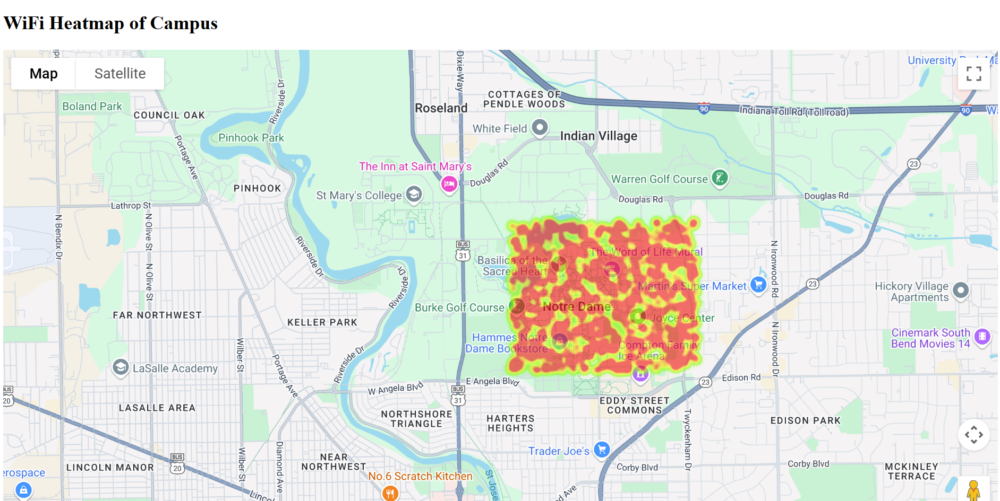
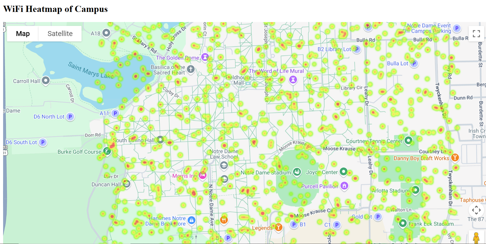

# WiFi Heatmap of Notre Dame Campus

This project visualizes WiFi signal strength across the Notre Dame campus using a dynamic heatmap powered by Flask and the Google Maps JavaScript API.

## Features
- Dynamic heatmap rendered with Google Maps
- Synthetic signal strength data generated via Python
- Flask backend with bounding box filtering for performance
- Responsive to pan/zoom

## Run Locally
1. Clone the repo
2. Create a virtual environment:
```python
python -m venv venv
```
3. Install dependencies:
pip install flask pandas
4. Generate data:
```python
python generate_wifi_data.py
```
5. Add your API key in `/static/config.js`:
```js
const API_KEY = "YOUR_KEY";
```
6. Start the server:
```python
python server/app.py
```
7. Visit `http://localhost` in your browser.

## Screenshots

### Full Campus Heatmap


### Zoomed-in View


## Note
You must insert your own Google Maps API key in `index.html`.

## Author
Luke Zimmermann, University of Notre Dame